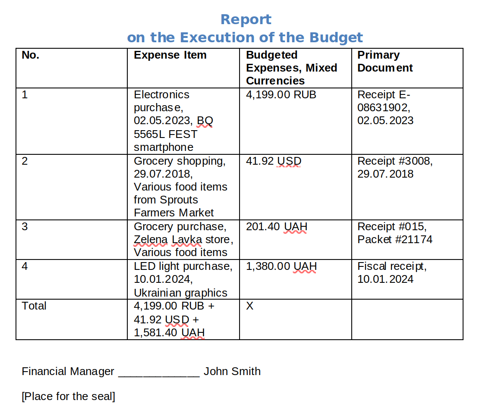

# Receipt Processing Automation

This script **automates the processing of receipts** using the Entropiq model. It takes files from the `Temp` folder or any other folder specified by the user, scans all receipts, and **generates a `.docx` document with a full list of expenses**.

## Main Features

- Automatic collection of receipts from the specified folder
- Receipt data recognition using the **Entropiq** model
- Creation and updating of a `.docx` report summarizing expenses
- **Iterative workflow**: you can edit the report and regenerate it until you achieve the desired result
- The script returns a log of its work and saves the final file to the specified directory

## Getting Started

1. Make sure you have a `.env` file with the following variables:
   - `ENTROPIQ_KEY` — your Entropiq API key
   - `FOLDER_PATH` — the path to the folder containing receipts and where the generated document will be saved

   ➔ See the `.env.example` file for reference.

2. **Alternative:** you can hardcode these parameters directly in the `consts.py` file (located in the `app` folder), but using `.env` is recommended for security and flexibility.

3. Place your receipts (files) into the folder specified by `FOLDER_PATH`.

4. Run the script and follow the instructions in the command line.

## How to run
```shell
python -W ignore main.py
```

## Examples

You can find ready-made test receipts in the **Received Examples** folder.

Below is an image showing what the final report will look like:



## Keywords

cheque processing, Entropiq receipt scanning, docx report generation, accounting automation, expense report, automate expense tracking, receipt OCR, bookkeeping script, financial reporting, iterative document update.
